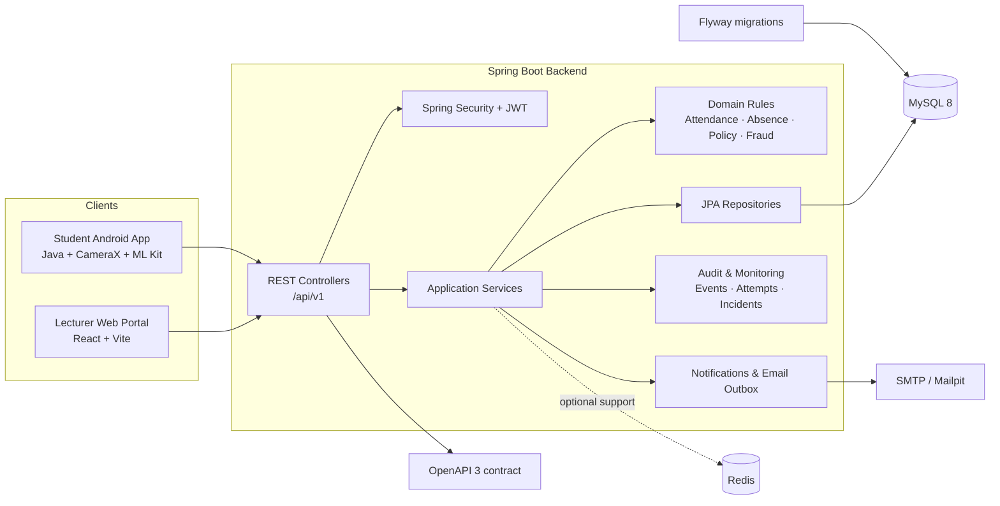
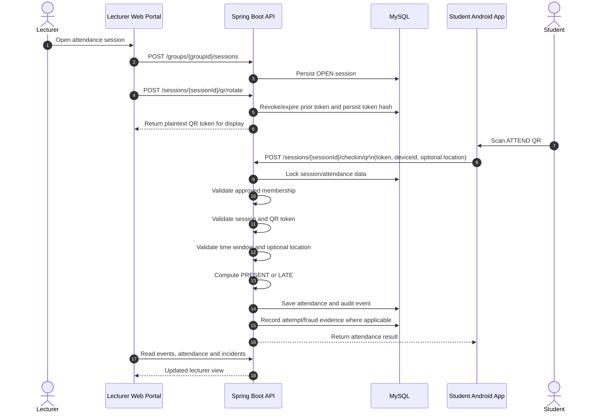

# UniAttend — Attendance Check by QR Code

[](https://github.com/binkadev/Attendance-Check-By-QRcode/actions/workflows/backend-ci.yml)


**UniAttend** is a production-like classroom attendance platform built around a clear product split:

- **Lecturers use a React web portal** to manage classes, students, attendance sessions, dynamic QR codes, absence requests, attendance history and suspicious activity.
- **Students use a native Android app** to join classes, scan attendance QR codes and track their own schedules, notifications and attendance records.
- **A Spring Boot backend** acts as the shared source of truth and enforces authentication, permissions, QR validity, attendance rules, state transitions, audit events and database integrity.

> **Project status:** academic/portfolio project, approximately **90% of the original scope**. The codebase is intentionally described as **production-like**; it is not presented as a deployed production system.

---

## Contents

- [Product overview](#product-overview)
- [What this project demonstrates](#what-this-project-demonstrates)
- [System architecture](#system-architecture)
- [Product capabilities](#product-capabilities)
- [Core attendance workflow](#core-attendance-workflow)
- [Backend engineering](#backend-engineering)
- [API surface](#api-surface)
- [Data model and migrations](#data-model-and-migrations)
- [Technology stack](#technology-stack)
- [Repository structure](#repository-structure)
- [Run locally](#run-locally)
- [Testing and CI](#testing-and-ci)
- [Current scope and limitations](#current-scope-and-limitations)
- [Roadmap](#roadmap)

---

## Product overview

UniAttend models a real classroom attendance workflow rather than treating attendance as a simple CRUD table.

| Actor | Primary client | Main responsibilities |
|---|---|---|
| **Student** | Native Android app | Join classes, view schedules, scan QR, receive check-in result, review personal attendance and notifications |
| **Lecturer / class owner** | React web portal | Create classes, manage students, run QR sessions, correct attendance, review absences, inspect incidents and export attendance |
| **Co-host** | React web portal | Assist selected class and session operations according to group permissions |
| **Backend operator** | REST/Admin API surfaces | Inspect authentication abuse, email outbox, notification delivery and monitoring data where implemented |

### End-to-end product flow

1. A lecturer creates a class and configures its academic information and weekly schedule.
2. Students join the class through its join code or join QR.
3. The lecturer opens an attendance session and displays a rotating QR code.
4. The Android app scans the QR and submits the token, session ID and stable device ID.
5. The backend validates membership, session state, QR token, time window, device evidence and optional location policy.
6. Attendance is recorded as `PRESENT` or `LATE`, with an audit event and monitoring evidence.
7. The lecturer reviews attendance, absence requests, session history and suspicious activity from the web portal.

---

## What this project demonstrates

This repository is strongest as a **backend-heavy full-stack portfolio project**.

| Engineering area | Evidence in the project |
|---|---|
| **Domain modeling** | Users, groups, memberships, weekly schedules, sessions, QR tokens, attendance records, absence requests, policies, notifications and fraud incidents |
| **Business rules** | Group roles, membership approval, session lifecycle, check-in windows, late calculation, absence transitions and manual correction restrictions |
| **Security-aware design** | Spring Security, JWT, persisted refresh sessions, password reset tokens, login/reset attempt logs and device evidence |
| **Reliability** | Idempotent duplicate QR scans, transactional writes, row locking and database constraints |
| **Data integrity** | Flyway migrations, foreign keys, unique/check constraints, indexes and selected trigger-based workflow hardening |
| **Auditability** | Attendance events, check-in attempt logs, fraud incidents and reviewable absence state changes |
| **API discipline** | Versioned REST API under `/api/v1` and an OpenAPI contract maintained in the backend |
| **Delivery discipline** | Maven Wrapper, Docker Compose and GitHub Actions using a real MySQL service during backend CI |
| **Client integration** | React/Vite lecturer portal and native Android student app consuming the same backend rules |

---

## System architecture



### Backend layering

| Layer | Responsibility |
|---|---|
| **Controller** | HTTP contracts, authentication principal resolution, input validation and response mapping |
| **Service** | Use-case orchestration, authorization-aware business logic, transactions and domain state changes |
| **Repository / EntityManager** | JPA queries, locking and persistence |
| **Database** | Relational integrity, indexes, constraints and selected workflow hardening |
| **OpenAPI** | Shared contract for client integration and API review |

---

## Product capabilities

### Lecturer Web Portal

Location: [`UniPortalAttendWeb/`](./UniPortalAttendWeb)

The web application is explicitly designed as a **lecturer portal**.

#### Dashboard and class operations

- Teaching dashboard with active class, absence and suspicious-activity summaries
- Attendance trend visualization by class and time range
- Upcoming teaching schedule
- Teaching-class search, semester filtering, sorting and pagination
- Create-class workflow with academic metadata and weekly schedule configuration
- Collapsible desktop navigation for dense management screens

#### Class management

- Class overview and student roster
- Membership status and attendance-risk indicators
- Join-class code/QR presentation
- Attendance summary and export actions where backed by the API
- Per-class navigation for students, QR sessions, session history, fraud incidents and absence requests

#### Live attendance operations

- Start or reopen an attendance session
- Configure open duration, late threshold and QR rotation interval
- Display dynamic QR code in normal or projector-oriented mode
- Pause/continue scanning and extend the session window
- View valid check-in count and attendance percentage
- End an active session

#### Review workflows

- Session history with status, time range and attendance rate
- Manual attendance correction and reset flows
- Suspicious-activity/fraud incident review
- Absence-request filtering, review and status visibility

### Student Android App

Location: [`UniPortalAttendApp/`](./UniPortalAttendApp)

The native Android application is designed for the **student self-service journey**.

- Register and log in
- View profile and personal notifications
- Browse joined and pending classes
- Search classes and filter by academic term
- View weekly class schedule
- Join a class by join code/QR
- View class details, lecturer information and attendance history
- Scan QR codes with CameraX and Google ML Kit
- Distinguish `JOIN:` and `ATTEND:` QR payloads
- Send the attendance token with a stable Android device ID
- Display successful check-in details
- Handle expired, invalid, wrong-session and permission-related responses
- View personal attendance summary and per-class history

### Spring Boot Backend

Location: [`backend springboot/`](./backend%20springboot)

The backend is the system's strongest engineering component and the shared source of truth for both clients.

- Authentication and session management
- Group/class lifecycle and membership approval
- Weekly schedules and academic metadata
- Attendance-session lifecycle
- Dynamic QR issuance and validation
- QR and manual attendance updates
- Absence-request workflow
- Attendance policies and student risk/status calculations
- Notifications and email-outbox infrastructure
- Check-in attempt logging and fraud-incident surfaces
- Admin/security monitoring endpoints
- OpenAPI documentation and Flyway-managed schema evolution

---

## Core attendance workflow



### Check-in rule summary

```text
Reject when the session is not OPEN.
Reject when the user is not an APPROVED group member.
Reject malformed, invalid, revoked, expired or wrong-session QR tokens.
Reject before check-in opens or after the check-in window closes.

lateThreshold = checkinOpenAt + lateAfterMinutes

now <= lateThreshold        -> PRESENT
lateThreshold < now <= close -> LATE
```

### Duplicate-scan behavior

Mobile cameras may emit the same scan multiple times. The backend treats an already successful check-in as an idempotent operation:

- Existing successful attendance is returned instead of rewriting it.
- `checkInAt` is not moved forward by repeated scans.
- Duplicate requests do not create unnecessary attendance events.

This protects the business record from UI/camera behavior and makes the endpoint safer under retries.

---

## Backend engineering

### Authentication and account security

- JWT access-token authentication with JJWT
- Persisted refresh sessions
- Refresh, logout and logout-all flows
- Password change and reset workflows
- Password reset token persistence
- Login-attempt and password-reset-attempt logging
- Authenticated `/me` profile API

### Authorization and group roles

The backend separates platform authentication from class-level membership.

- Group roles include owner/co-host/member-style responsibilities.
- Membership has its own lifecycle such as pending, approved, rejected and removed.
- Lecturer actions are guarded by ownership/co-host permissions.
- Student participation requires approved class membership.

### QR token security

- The displayed token is associated with a specific attendance session.
- Token references/hashes are persisted rather than relying on the client as a source of truth.
- Expired, revoked, malformed and wrong-session tokens are rejected.
- QR rotation supports short-lived dynamic attendance codes.
- The Android scanner normalizes the expected `<tokenId>.<secret>` token format before submission.

### Transactional correctness

- Attendance writes execute inside transactions.
- Session/attendance data is locked for check-in-sensitive operations.
- A session/user attendance record is created or locked safely before mutation.
- Unique database keys protect one logical attendance record per user and session.
- Data-integrity exceptions are translated into API-level errors.

### Device and location evidence

- QR check-in requires a stable `deviceId`.
- The Android client currently uses `Settings.Secure.ANDROID_ID`.
- Optional latitude/longitude values can be validated together.
- When a class policy requires location, distance is computed against the configured coordinates and allowed radius.
- Reuse of the same device for multiple accounts in one session can be marked as suspicious evidence.

### Attendance events and monitoring

Successful attendance changes can produce an attendance event containing details such as:

- Previous and new status
- QR token reference
- Device ID
- IP address and user agent
- Optional coordinates and computed distance
- Check-in window and late threshold
- Suspicious flags/reasons

Failed and successful check-in attempts are also available to the fraud/monitoring layer without making the attendance transaction depend entirely on monitoring success.

### Absence workflow

The absence module separates `EXCUSED` attendance from ordinary manual correction.

- Students submit session/class-scoped requests.
- Lecturers review and approve/reject requests.
- Students can cancel eligible requests.
- Privileged users can revert eligible decisions.
- Database hardening protects selected invalid state transitions.

### Notifications and email

- Persistent in-app notification records
- Read/unread operations and unread count
- Check-in success notifications
- Notification delivery tracking surfaces
- Email outbox model
- Mailpit integration for local SMTP testing

---

## API surface

The versioned API is exposed under `/api/v1`.

OpenAPI contract:

```text
backend springboot/src/main/resources/static/openapi.yaml
```

Representative endpoints:

| Area | Endpoints |
|---|---|
| **Authentication** | `POST /auth/register`, `/auth/login`, `/auth/refresh`, `/auth/logout`, `/auth/logout-all`, `/auth/forgot-password`, `/auth/reset-password` |
| **Current user** | `GET/PATCH /me`, `GET /me/classes`, `GET /me/classes/teaching`, `GET /me/classes/timeline`, `GET /me/sessions/upcoming` |
| **Classes/groups** | `POST /groups`, `GET/PATCH /groups/{groupId}`, `POST /groups/join` |
| **Members** | `GET /groups/{groupId}/members` plus membership review/role operations |
| **Sessions** | `POST/GET /groups/{groupId}/sessions`, `GET /groups/{groupId}/sessions/open`, session close/cancel/reopen operations |
| **Dynamic QR** | `POST /sessions/{sessionId}/qr/rotate` |
| **QR check-in** | `POST /sessions/{sessionId}/checkin/qr` |
| **Attendance** | Session attendance list, manual update/reset, attendance events, group summary and export |
| **Student history** | `GET /groups/{groupId}/me/attendance-history`, `GET /me/attendance/summary` |
| **Absence** | Group request list/create and request review/cancel/revert operations |
| **Policy** | Group attendance policy and per-student policy status |
| **Notifications** | Personal list, unread count, mark-read and mark-all-read operations |
| **Monitoring** | Group fraud incidents, check-in attempts and admin security surfaces |

> The OpenAPI file should remain synchronized whenever convenience endpoints or client contracts change.

---

## Data model and migrations

Database migrations:

```text
backend springboot/src/main/resources/db/migration
```

### Main data areas

| Domain | Representative tables |
|---|---|
| **Identity** | `users`, `user_sessions`, `password_reset_tokens`, `login_attempts`, `password_reset_attempts` |
| **Classes** | `class_groups`, `group_members`, `group_weekly_schedules` |
| **Attendance** | `attendance_sessions`, `session_attendance`, `qr_tokens`, `attendance_events` |
| **Absence and policy** | `absence_requests`, `attendance_policies` |
| **Communication** | `notifications`, `notification_deliveries`, `notification_rule_configs`, `email_outbox` |
| **Monitoring** | `checkin_attempt_logs`, `fraud_incidents` |

### Integrity techniques

- Foreign keys for relationship safety
- Unique keys for business invariants
- Check constraints for allowed statuses and numeric ranges
- Indexes for common read paths
- Flyway versioning for repeatable environment setup
- Selected database triggers for workflow hardening
- UTC-oriented time handling in backend/database configuration

---

## Technology stack

### Backend

| Category | Technology |
|---|---|
| Language/runtime | Java 17 bytecode target |
| Framework | Spring Boot 3.5.10 |
| Web/API | Spring Web, Validation, springdoc-openapi |
| Security | Spring Security, JJWT 0.12.6 |
| Persistence | Spring Data JPA, Hibernate, MySQL Connector |
| Database | MySQL 8 |
| Migrations | Flyway Core + Flyway MySQL |
| Supporting infrastructure | Redis, Spring Mail, Actuator, WebSocket dependency |
| Testing | JUnit 5, Spring Boot Test, Spring Security Test, Testcontainers support |
| Build | Maven Wrapper |

### Lecturer Web Portal

| Category | Technology |
|---|---|
| UI | React 19.2 |
| Tooling | Vite 8 |
| Routing | React Router 7 |
| Styling | Tailwind CSS 3.4, PostCSS, Autoprefixer |
| Components | lucide-react, react-hot-toast |
| Visualization | Recharts |
| QR display | qrcode.react |
| Device parsing | ua-parser-js |

### Student Android App

| Category | Technology |
|---|---|
| Platform | Native Android |
| Language compatibility | Java 11 |
| SDK | minSdk 27, targetSdk 36 |
| Camera | CameraX 1.3.1 |
| QR recognition | Google ML Kit Barcode Scanning 17.2.0 |
| Networking | Retrofit 2.9 + Gson converter |
| UI | AppCompat, Material Components, ConstraintLayout, SwipeRefreshLayout |

### Local infrastructure

| Service | Purpose |
|---|---|
| MySQL 8 | Application data |
| Redis 7 | Supporting cache/infrastructure capability |
| Mailpit | Local email capture and inspection |
| Docker Compose | Reproducible backend development environment |

---

## Repository structure

```text
.
├── backend springboot/                 # Shared Spring Boot API
│   ├── src/main/java/com/attendance/backend/
│   │   ├── auth/                       # Authentication and current user
│   │   ├── group/                      # Classes and memberships
│   │   ├── attendance/                 # Sessions, QR and attendance
│   │   ├── absence/                    # Absence workflow
│   │   ├── notification/               # In-app notifications
│   │   ├── fraud/                      # Attempts and incidents
│   │   ├── adminsecurity/              # Security monitoring surfaces
│   │   ├── me/                         # User-scoped read APIs
│   │   ├── mail/                       # Email/outbox support
│   │   ├── common/                     # Shared errors and utilities
│   │   └── config/                     # Application configuration
│   ├── src/main/resources/
│   │   ├── db/migration/               # Flyway migrations
│   │   └── static/openapi.yaml         # API contract
│   ├── src/test/                       # Backend tests
│   ├── Dockerfile
│   └── pom.xml
│
├── UniPortalAttendWeb/                 # Lecturer React web portal
│   ├── src/api/                        # Backend API clients
│   ├── src/components/                 # Shared UI/layout components
│   ├── src/features/                   # Dashboard, classes, auth, history...
│   └── package.json
│
├── UniPortalAttendApp/                 # Student native Android app
│   ├── app/src/main/java/com/ptithcm/attendapp/
│   │   ├── api/                        # Retrofit definitions/client
│   │   ├── model/                      # Request/response models
│   │   ├── view/                       # Activities/fragments/adapters
│   │   └── viewmodel/
│   └── app/build.gradle
│
├── .github/workflows/backend-ci.yml    # MySQL-backed backend CI
└── docker-compose.yml                  # MySQL, Redis, Mailpit, backend
```

---

## Run locally

### Prerequisites

- Docker Desktop with Docker Compose
- JDK 17+ for local backend development
- Node.js/npm for the lecturer portal
- Android Studio for the student app

### Option A — Docker Compose backend environment

From the repository root:

```bash
docker compose up --build
```

Services configured by the repository:

| Service | Local port |
|---|---:|
| Spring Boot API | `8081` |
| MySQL | `3307` |
| Redis | `6379` |
| Mailpit web UI | `8025` |
| Mailpit SMTP | `1025` |

Stop the environment:

```bash
docker compose down
```

Remove local database volume as well:

```bash
docker compose down -v
```

### Option B — Run the backend with Maven

Start MySQL/Redis/Mailpit as required by the active profile, then run:

```bash
cd "backend springboot"
./mvnw spring-boot:run -Pdev
```

Windows PowerShell:

```powershell
cd "backend springboot"
./mvnw.cmd spring-boot:run -Pdev
```

> The backend folder contains a space, so keep the path quoted in shell commands.

### Run the lecturer web portal

```bash
cd UniPortalAttendWeb
npm install
npm run dev
```

Additional commands:

```bash
npm run build
npm run lint
npm run preview
```

The current web client is primarily configured for a backend running at `http://localhost:8081`.

### Run the student Android app

1. Open `UniPortalAttendApp` in Android Studio.
2. Allow Gradle synchronization to complete.
3. Configure the Retrofit base URL for the machine/device running the backend.
4. Run on an Android emulator or physical device with camera permission.
5. For a physical device, ensure the backend host is reachable from the same network.

---

## Testing and CI

### Backend tests

```bash
cd "backend springboot"
./mvnw test
```

Windows:

```powershell
cd "backend springboot"
./mvnw.cmd test
```

The test suite includes unit/controller/integration-style coverage depending on the module, with Spring Boot Test, MockMvc, Spring Security Test and Testcontainers dependencies available.

### GitHub Actions

Workflow:

```text
.github/workflows/backend-ci.yml
```

The current CI pipeline:

1. Runs on push, pull request and manual dispatch.
2. Starts a MySQL 8 service.
3. Configures the test database collation.
4. Uses Temurin JDK 21 while compiling the project for Java 17 bytecode.
5. Runs the Maven test suite with the test profile.
6. Prints diagnostic Surefire output when tests fail.
7. Uploads Surefire reports as workflow artifacts.

> Current automated CI is focused on the backend. Dedicated web and Android CI pipelines are future improvements.

---

## Current scope and limitations

This section is deliberately explicit so the repository remains credible in a CV or technical interview.

### Implemented or clearly represented in source

- Lecturer web portal
- Student Android app
- Spring Boot REST backend
- JWT authentication and refresh-session persistence
- MySQL schema managed by Flyway
- QR session creation, rotation and check-in
- Device-aware check-in evidence
- Class, membership, session, attendance and absence workflows
- Attendance policy, notification and fraud-monitoring surfaces
- Docker Compose local environment
- Passing backend CI workflow

### Not claimed

- A live public production deployment
- Proven high-scale production traffic
- Complete observability/operations dashboards
- Fully autonomous fraud detection
- Production-grade push notification delivery across all channels
- Complete end-to-end CI for web and Android

### Known cleanup opportunities

- Move all web API base URLs into environment configuration.
- Keep client calls and `openapi.yaml` synchronized as endpoints evolve.
- Replace remaining UI fallback/demo metrics with backend-backed values.
- Add automated build/lint pipelines for the React and Android clients.
- Clean up commented diagnostic/legacy code before a formal release.
- Verify the web profile-update client path against the backend `PATCH /api/v1/me` contract.

---

## Roadmap

- [ ] Add curated screenshots under `docs/screenshots/`
- [ ] Add a short end-to-end product demo video
- [ ] Add a polished ERD and deployment diagram
- [ ] Environment-drive the web and Android API base URLs
- [ ] Add React build/lint CI
- [ ] Add Android unit/build CI
- [ ] Expand end-to-end integration tests for lecturer-to-student attendance flow
- [ ] Add structured metrics, tracing and operational dashboards
- [ ] Reconcile all client/API/OpenAPI contracts before a tagged release
- [ ] Document a deployment environment only after an actual deployment exists

---

## Portfolio positioning

A precise way to describe this repository on a CV:

> Built a production-like QR attendance platform with a React lecturer portal, native Android student app and Spring Boot/MySQL backend. Implemented JWT sessions, role-aware class workflows, rotating QR validation, idempotent attendance check-in, absence management, device/location evidence, Flyway migrations, OpenAPI documentation and MySQL-backed GitHub Actions CI.

---

## Author

**binkadev**  
PTIT — D22

---

> **Lecturers manage attendance from the web. Students check in from Android. The backend enforces the rules.**
