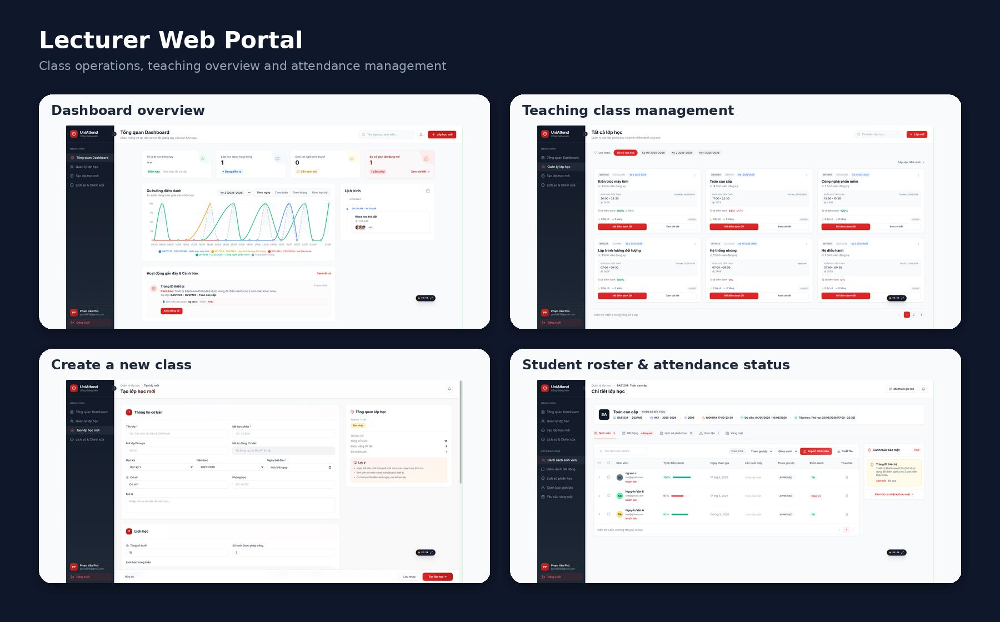
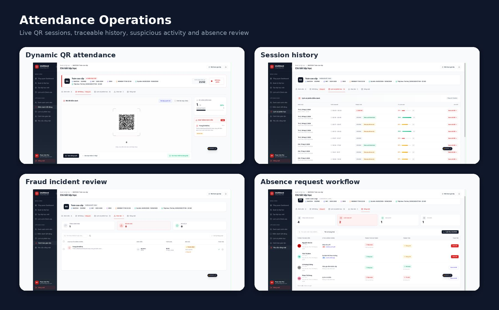
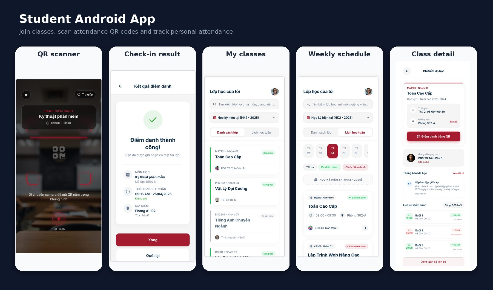
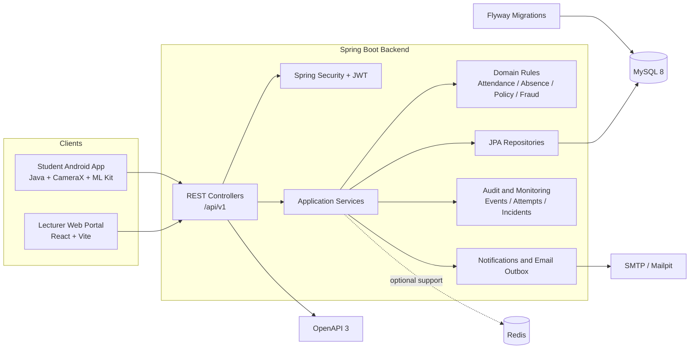
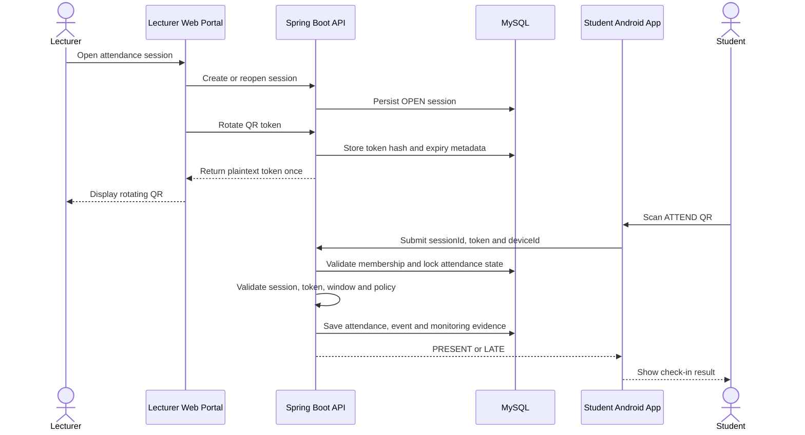

# UniAttend — Attendance Check by QR Code

[](https://github.com/binkadev/Attendance-Check-By-QRcode/actions/workflows/backend-ci.yml)


**UniAttend** is a production-like classroom attendance platform built around QR-based check-in and a clear separation of user experiences:

- **Lecturers use the React web portal** to create classes, manage students, run attendance sessions, display rotating QR codes, review absence requests, correct attendance and inspect suspicious activity.
- **Students use the native Android app** to join classes, scan attendance QR codes, view schedules, receive check-in results and review their attendance history.
- **The Spring Boot backend** is the shared source of truth that enforces authentication, permissions, QR validity, attendance rules, workflow transitions, audit events and database integrity.

> **Project status:** academic and portfolio project with approximately **90% of the original scope implemented**. The system is intentionally described as **production-like** and is not presented as a deployed production system.

---

## Product Preview

### Lecturer Web Portal





### Student Android App



---

## Table of Contents

- [Product Overview](#product-overview)
- [What This Project Demonstrates](#what-this-project-demonstrates)
- [System Architecture](#system-architecture)
- [Product Capabilities](#product-capabilities)
- [Core QR Attendance Workflow](#core-qr-attendance-workflow)
- [Backend Engineering Highlights](#backend-engineering-highlights)
- [API Overview](#api-overview)
- [Database and Flyway](#database-and-flyway)
- [Technology Stack](#technology-stack)
- [Repository Structure](#repository-structure)
- [Run Locally](#run-locally)
- [Testing and CI](#testing-and-ci)
- [Current Scope and Limitations](#current-scope-and-limitations)
- [Roadmap](#roadmap)

---

## Product Overview

UniAttend models classroom attendance as a domain workflow rather than as a simple CRUD table.

| Actor | Primary client | Main responsibilities |
|---|---|---|
| **Student** | Native Android app | Join classes, view schedules, scan QR, receive check-in results, review attendance and notifications |
| **Lecturer / class owner** | React web portal | Create classes, manage students, run QR sessions, correct attendance, review absences and inspect incidents |
| **Co-host** | React web portal | Assist selected class and session operations according to group permissions |
| **Backend operator** | REST and admin API surfaces | Inspect authentication abuse, email outbox, notification delivery and monitoring data where implemented |

### End-to-end flow

1. A lecturer creates a class and configures its academic information and weekly schedule.
2. Students join through the class join code or join QR.
3. The lecturer opens an attendance session and displays a rotating QR code.
4. The Android app scans the QR and submits the token, session ID and stable device ID.
5. The backend validates membership, session state, QR token, time window, device evidence and optional location policy.
6. Attendance is recorded as `PRESENT` or `LATE`, with an audit event and monitoring evidence.
7. The lecturer reviews attendance, absence requests, session history and suspicious activity from the web portal.

---

## What This Project Demonstrates

This repository is strongest as a **backend-heavy full-stack portfolio project**.

| Engineering area | Evidence in the project |
|---|---|
| **Domain modeling** | Users, groups, memberships, weekly schedules, sessions, QR tokens, attendance, absence requests, policies, notifications and fraud incidents |
| **Business rules** | Group roles, membership approval, session lifecycle, check-in windows, late calculation, absence transitions and manual correction restrictions |
| **Security-aware design** | Spring Security, JWT, persisted refresh sessions, password-reset tokens, login/reset attempt logs and device evidence |
| **Reliability** | Idempotent duplicate QR scans, transactional writes, database locking and relational constraints |
| **Data integrity** | Flyway migrations, foreign keys, unique/check constraints, indexes and selected trigger-based hardening |
| **Auditability** | Attendance events, check-in attempt logs, fraud incidents and reviewable absence state changes |
| **API discipline** | Versioned REST APIs under `/api/v1` and an OpenAPI contract maintained with the backend |
| **Delivery discipline** | Maven Wrapper, Docker Compose and GitHub Actions using a MySQL service during backend CI |
| **Client integration** | React/Vite lecturer portal and native Android student app consuming the same backend rules |

---

## System Architecture



### Backend layering

| Layer | Responsibility |
|---|---|
| Controllers | Expose REST endpoints, validate request shape and resolve the authenticated principal |
| Application services | Execute use cases, enforce authorization and coordinate transactions |
| Domain model | Represent entities, statuses, policies and business transitions |
| Repositories | Encapsulate JPA persistence and query operations |
| Database | Protect relational integrity and selected workflow invariants |
| OpenAPI | Document the public API contract used by the clients |

---

## Product Capabilities

### Lecturer Web Portal

The web portal is intentionally designed for lecturers and class managers.

- Authentication and profile flows
- Dashboard with teaching activity, schedule and warning summaries
- Teaching-class search, filtering, sorting and pagination
- Create-class workflow with academic metadata and weekly schedule
- Student and membership management
- Join-code and join-QR presentation
- Dynamic attendance session creation and QR rotation
- Projector-oriented QR display mode
- Attendance progress during an active session
- Session history and attendance details
- Manual attendance correction
- Attendance spreadsheet export
- Absence-request review
- Suspicious check-in and shared-device incident views

### Student Android App

The Android app is designed for the student self-service journey.

- Registration and login
- Personal class list and weekly schedule
- Join class through QR or join code
- Class detail and upcoming-session information
- QR scanning through CameraX and Google ML Kit
- Stable Android device ID attached to QR check-in requests
- Check-in result screen
- Personal attendance history and summary
- Notifications and unread-count flows
- Profile information

### Spring Boot Backend

The backend provides the shared rules and persistence layer for both clients.

- JWT authentication and refresh-session persistence
- Current-session logout and logout-all support
- Password change and reset workflow
- Class/group lifecycle and academic metadata
- Owner, co-host and member permission model
- Membership approval and ownership-transfer flows
- Attendance session lifecycle
- QR-token rotation and hash-based verification
- QR check-in with time-window and late-threshold rules
- Idempotent handling of repeated successful scans
- Optional geolocation policy and distance calculation
- Manual attendance correction and audit events
- Absence request review, cancellation and revert flows
- Attendance policy and student-risk status surfaces
- Notification persistence and email-outbox support
- Check-in attempt logs and fraud-incident records
- Security-monitoring API surfaces

---

## Core QR Attendance Workflow



### Check-in rules

- The user must be an approved member of the class.
- The attendance session must be `OPEN`.
- The QR token must belong to the requested session.
- Invalid, malformed, expired or revoked tokens are rejected.
- Check-in before the open time or after the close time is rejected.
- Check-in at or before the late threshold becomes `PRESENT`.
- Check-in after the threshold but before closing becomes `LATE`.
- A repeated successful camera request returns the existing result without rewriting the original check-in time.
- `EXCUSED` attendance remains controlled by the approved absence workflow.
- A shared device can be recorded as suspicious evidence for lecturer review.

---

## Backend Engineering Highlights

### Authentication and session security

- Spring Security and JWT authentication
- Persisted refresh sessions rather than stateless refresh tokens only
- Refresh-token rotation support
- Logout current session and logout all sessions
- Password change and password-reset flows
- Login-attempt and password-reset-attempt records for monitoring

### Transactional correctness

QR attendance is implemented as a transactional operation. The service validates the session and token, locks or creates the attendance row, preserves duplicate-scan idempotency, writes the attendance result and creates the related event within the controlled workflow.

### QR-token handling

The backend stores QR hash/reference data instead of treating the displayed plaintext value as ordinary persistent application data. A rotated plaintext token is returned to the lecturer client for display, while later check-ins are verified against stored token metadata.

### Attendance status separation

- `PRESENT` and `LATE` are calculated from the check-in window.
- `ABSENT` represents the current lack of an accepted check-in.
- `EXCUSED` is tied to the absence-request workflow.
- Manual correction is permission-controlled and generates audit-style evidence.

### Fraud and monitoring support

The system records check-in attempts and supporting evidence such as device ID, IP address, user agent, token information and optional location data. Shared-device usage can be surfaced as a suspicious incident for lecturer review.

> This is monitoring and incident-management support. It is not described as an autonomous or machine-learning fraud engine.

---

## API Overview

The maintained OpenAPI contract is located at:

```text
backend springboot/src/main/resources/static/openapi.yaml
```

Representative API groups:

| Area | Representative endpoints |
|---|---|
| Authentication | `/api/v1/auth/login`, `/register`, `/refresh`, `/logout`, `/reset-password` |
| Current user | `/api/v1/me`, `/me/classes`, `/me/classes/teaching`, `/me/classes/timeline` |
| Groups | `/api/v1/groups`, `/groups/{groupId}`, `/groups/join` |
| Members | `/api/v1/groups/{groupId}/members` |
| Sessions | `/api/v1/groups/{groupId}/sessions`, `/sessions/{sessionId}/close`, `/cancel` |
| QR attendance | `/api/v1/sessions/{sessionId}/qr/rotate`, `/checkin/qr` |
| Attendance reads | `/api/v1/sessions/{sessionId}/attendance`, `/attendance-events` |
| Student history | `/api/v1/groups/{groupId}/me/attendance-history` |
| Absence requests | `/api/v1/groups/{groupId}/absence-requests`, `/absence-requests/{requestId}/review` |
| Policy | `/api/v1/groups/{groupId}/attendance-policy`, `/attendance-policy/students` |
| Notifications | `/api/v1/me/notifications`, `/unread-count`, `/read-all` |
| Monitoring | Fraud-incident, check-in-attempt and admin-security surfaces |

The backend remains the behavioral source of truth. The OpenAPI contract should be updated whenever controller endpoints or DTOs change.

---

## Database and Flyway

Schema evolution is managed through versioned Flyway migrations:

```text
backend springboot/src/main/resources/db/migration
```

Core tables include:

- `users`
- `user_sessions`
- `class_groups`
- `group_members`
- `group_weekly_schedules`
- `attendance_sessions`
- `session_attendance`
- `qr_tokens`
- `attendance_events`
- `absence_requests`
- `attendance_policies`
- `notifications`
- `notification_deliveries`
- `notification_rule_configs`
- `email_outbox`
- `password_reset_tokens`
- `password_reset_attempts`
- `login_attempts`
- `checkin_attempt_logs`
- `fraud_incidents`

Integrity techniques used in the project include foreign keys, unique constraints, check constraints, indexes, selected triggers and migration-based schema changes instead of manual database edits.

---

## Technology Stack

### Backend

| Area | Technology |
|---|---|
| Language | Java 17 |
| Framework | Spring Boot 3.5.10 |
| Web and validation | Spring Web, Bean Validation |
| Security | Spring Security, JJWT |
| Persistence | Spring Data JPA, Hibernate |
| Database | MySQL 8 |
| Migrations | Flyway |
| Supporting infrastructure | Redis, Spring Mail, Mailpit |
| API documentation | springdoc-openapi, OpenAPI 3 |
| Testing | JUnit 5, Mockito, MockMvc, Spring Security Test, Testcontainers support |
| Build | Maven Wrapper |

### Lecturer Web Portal

| Area | Technology |
|---|---|
| Framework | React 19 |
| Build tool | Vite 8 |
| Routing | React Router 7 |
| Styling | Tailwind CSS 3 |
| Charts | Recharts |
| QR rendering | qrcode.react |
| UI utilities | Lucide React, react-hot-toast |

### Student Android App

| Area | Technology |
|---|---|
| Platform | Native Android |
| Language | Java 11 source compatibility |
| Minimum SDK | 27 |
| Target SDK | 36 |
| QR scanning | CameraX and Google ML Kit Barcode Scanning |
| Networking | Retrofit and Gson |
| UI | AppCompat, Material Components, ConstraintLayout |

---

## Repository Structure

```text
.
├── backend springboot/        # Spring Boot backend and OpenAPI contract
├── UniPortalAttendWeb/        # Lecturer React/Vite web portal
├── UniPortalAttendApp/        # Primary native Android student app
├── mobile android/            # Additional/legacy Android workspace in the repository
├── docs/
│   └── showcase/              # Product screenshots used by this README
├── .github/workflows/
│   └── backend-ci.yml         # MySQL-backed backend CI
├── docker-compose.yml         # MySQL, Redis, Mailpit and backend
└── README.md
```

`UniPortalAttendApp/` is the Android application referenced by this README. The additional `mobile android/` workspace should be treated as a separate or legacy workspace unless it is explicitly promoted as another supported client.

---

## Run Locally

### Prerequisites

- JDK 17 or newer
- Node.js and npm
- Android Studio
- Docker Desktop, recommended for local infrastructure

### Option 1: Start backend infrastructure with Docker Compose

```bash
git clone https://github.com/binkadev/Attendance-Check-By-QRcode.git
cd Attendance-Check-By-QRcode
docker compose up --build
```

The compose setup includes:

- MySQL on host port `3307`
- Redis on `6379`
- Mailpit SMTP on `1025`
- Mailpit web interface on `8025`
- Spring Boot backend on `8081`

### Option 2: Run the backend with Maven

Start the required database services, then run:

```bash
cd "backend springboot"
./mvnw spring-boot:run -Pdev
```

Windows PowerShell:

```powershell
cd "backend springboot"
./mvnw.cmd spring-boot:run -Pdev
```

### Run the lecturer web portal

```bash
cd UniPortalAttendWeb
npm install
npm run dev
```

The current web source primarily targets a backend at `http://localhost:8081`. Moving the base URL into a Vite environment variable is recommended before deployment.

### Run the student Android app

1. Open `UniPortalAttendApp/` in Android Studio.
2. Configure the Retrofit base URL for the machine or network hosting the backend.
3. Run the app on an emulator or physical Android device.
4. Grant camera permission for QR scanning.

---

## Testing and CI

Run backend tests locally:

```bash
cd "backend springboot"
./mvnw test
```

The GitHub Actions workflow at `.github/workflows/backend-ci.yml`:

- Runs on push, pull request and manual dispatch
- Starts a MySQL 8 service
- Configures UTF-8 database collation
- Uses Temurin JDK 21 to execute the Java 17-targeted Maven project
- Runs the Maven test suite
- Uploads Surefire reports even when tests fail

The status badge at the top of this README reflects the current backend CI workflow.

---

## Current Scope and Limitations

Implemented or visible in source:

- Lecturer web portal
- Student Android app
- Spring Boot REST backend
- JWT and persisted refresh sessions
- MySQL schema managed by Flyway
- OpenAPI contract
- QR-based attendance and rotating token flow
- Attendance session, absence and policy workflows
- Attendance events and monitoring evidence
- Notifications and email-outbox infrastructure
- Docker Compose local environment
- MySQL-backed GitHub Actions CI

Deliberate limitations and honest wording:

- The project is **production-like**, not a deployed production service.
- Approximately 90% of the originally planned scope is implemented.
- Some lecturer dashboard values may still use fallback presentation data when an API response is unavailable.
- The web API base URL is still largely local-development oriented.
- Notification infrastructure should not be described as proven high-scale delivery.
- Fraud support is rule/evidence based monitoring, not advanced autonomous detection.
- No performance or scalability claim is made without formal load-test evidence.

---

## Roadmap

- Move all client API base URLs to environment-specific configuration
- Keep OpenAPI synchronized with controllers and DTOs
- Remove remaining UI fallback metrics and use backend data consistently
- Expand end-to-end tests across web, Android and backend
- Add concurrency and load tests for QR check-in
- Add structured metrics, tracing and operational dashboards
- Clarify or archive the secondary Android workspace
- Add a short product walkthrough video
- Document a deployment environment after a real deployment exists

---

## CV Summary

> Built UniAttend, a backend-heavy classroom attendance platform with a React lecturer portal, a native Android student app and a Spring Boot REST API. Implemented JWT/refresh-session authentication, rotating QR check-in, attendance and absence workflows, Flyway-managed MySQL integrity, audit and monitoring records, Docker Compose infrastructure and MySQL-backed GitHub Actions CI.

---

## Author

**binkadev** — PTIT D22

---

**Lecturers manage attendance from the Web Portal. Students check in from the Android App. The Spring Boot backend enforces the rules.**
